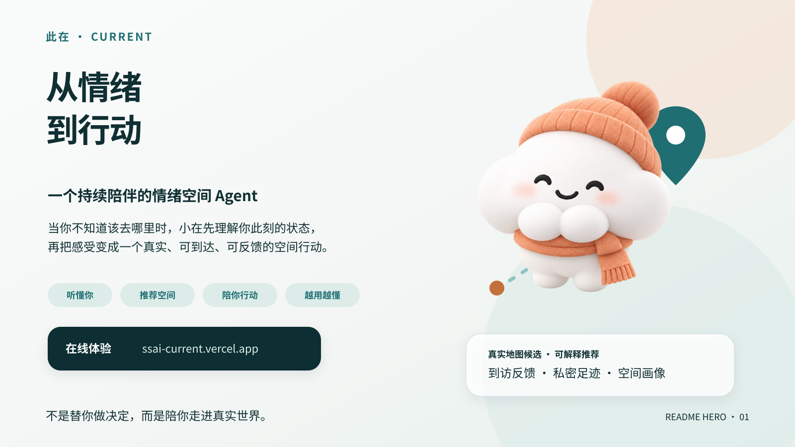
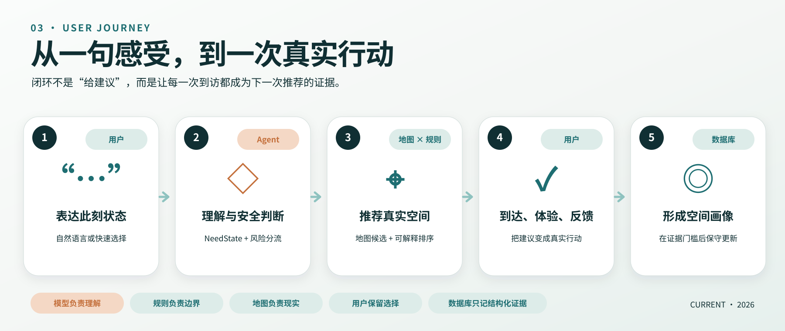
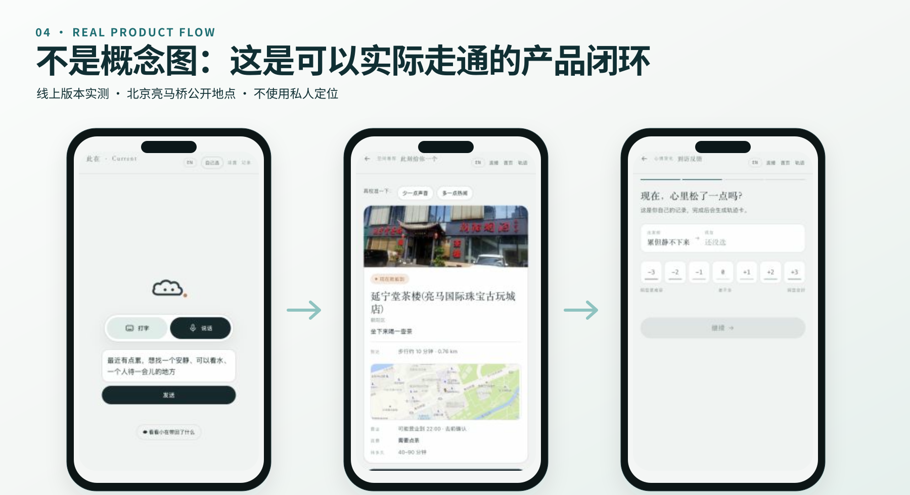
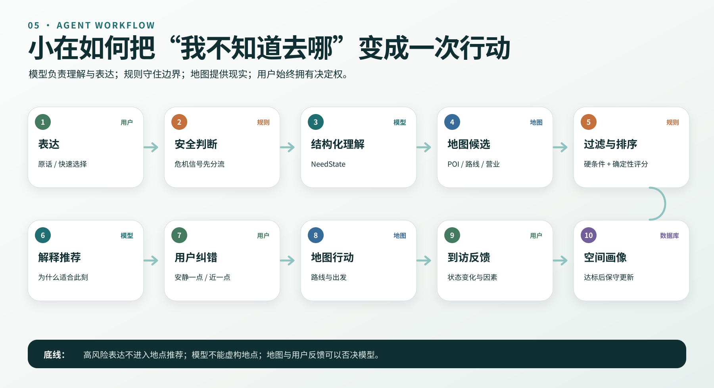
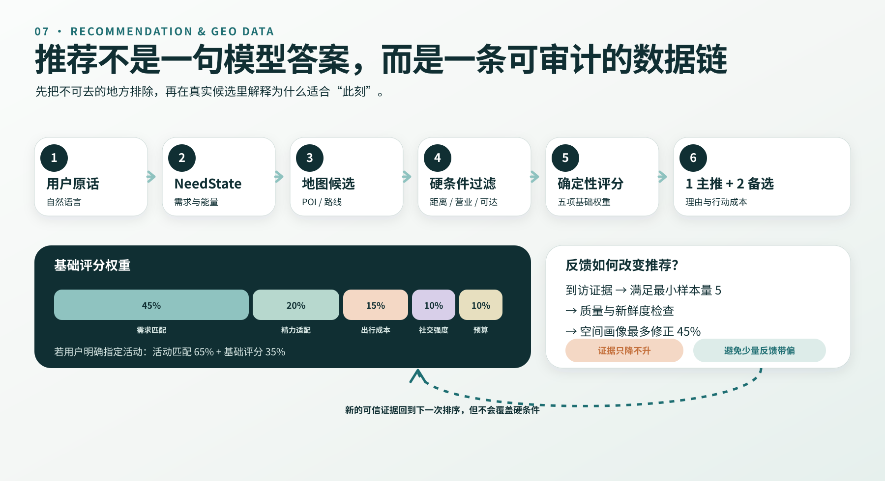
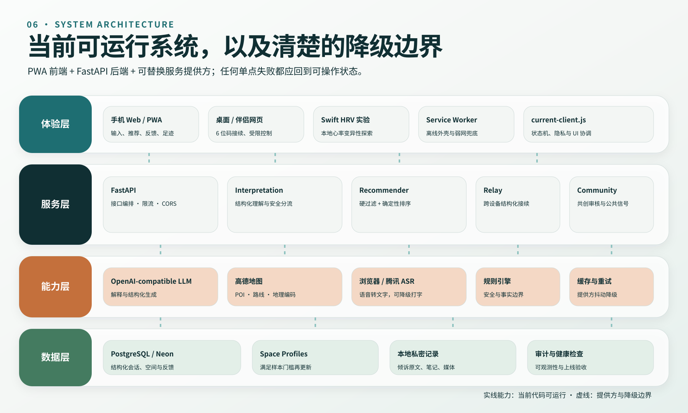
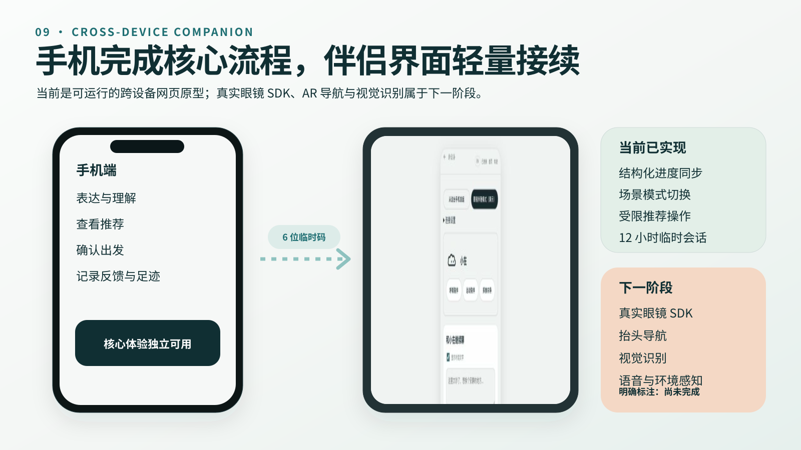
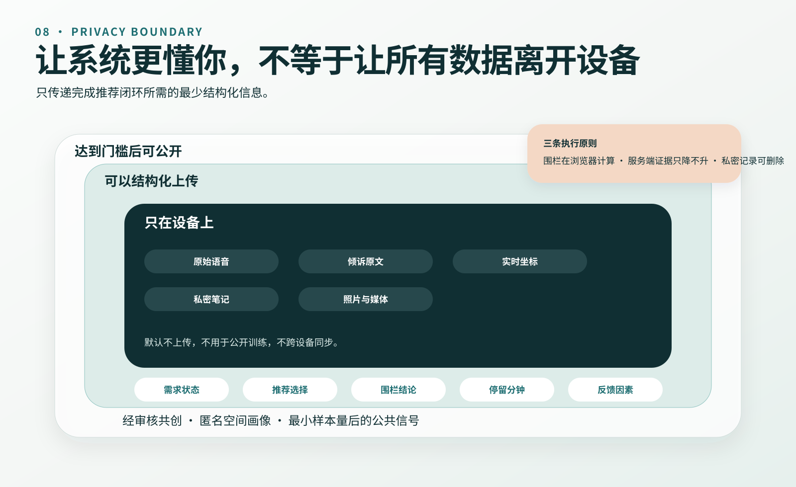
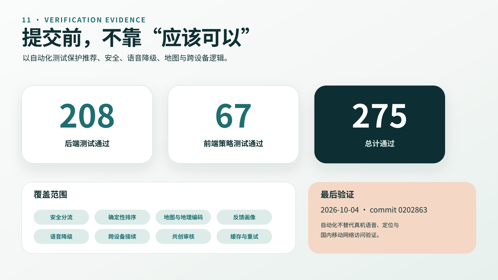
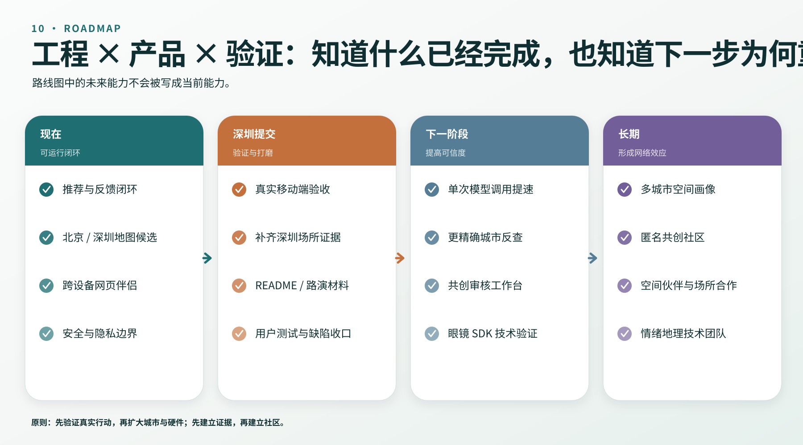

# 此在 Current

<div align="center">
  
  <h3>从情绪到行动的情绪空间 Agent</h3>
  <p><strong>在说不清的时刻，找到一个此刻真正适合你的地方，并陪你走到那里。</strong></p>
  <p><em>From a hard-to-name feeling to a real place you can reach now.</em></p>
  <p>
    <a href="https://current.heyjue.com"><strong>在线体验</strong></a>
    · <a href="#五步核心体验">核心体验</a>
    · <a href="#快速开始">本地运行</a>
    · <a href="#spotlight-八问">Spotlight 八问</a>
  </p>
  <p>Live Web Prototype · 中文 / English · Privacy-first · Cross-device Companion Prototype</p>
</div>



> **此在 Current** 是一个把“此刻的感受”转化为“真实空间行动”的情绪空间 Agent。<br>
> 用户不需要先想好地点类别或筛选条件，只要说出现在的状态；小在会理解需求和现实限制，寻找真实地点，说明为什么推荐，陪用户出发，并在到访后用经同意的反馈校准下一次推荐。

**当前可运行：**文字与语音表达、结构化情绪理解、真实 POI 搜索、可解释推荐、路线跳转、到访反馈、私密足迹、用户共创审核与跨设备伴侣网页原型。

**当前边界：**智能眼镜部分仍是跨设备交互原型，尚未接入真实眼镜 SDK、AR 导航、视觉识别或步频传感器。我们在文档中明确区分“已实现”“可验证原型”和“下一阶段”。

---

## 30 秒看懂此在

大多数地点产品从“你要找什么”开始：咖啡馆、公园、书店，或者附近高分榜单。可人在真正需要被接住的时候，往往说不清自己要去哪，只知道“脑子停不下来”“不想回家”“想找个不用说话的地方”。

此在把产品单位从“一次搜索”改成了“**一次出门**”。

| 普通地点应用 | 此在 Current |
| --- | --- |
| 用户先知道自己要搜索什么 | 用户只需要说出此刻的感受或活动意图 |
| 用类目、距离、热度和评分排序 | 同时考虑需要、精力、社交方式、预算、距离、营业状态和明确活动 |
| 推荐结束于地点卡片 | Agent 继续承担纠错、出发、到达、反馈和记录 |
| 每次搜索彼此独立 | 经核验、经同意的到访反馈可以保守修正空间画像 |
| 手机里的一个固定功能 | 同一会话可在手机、桌面和伴侣端之间接续 |

一句话概括：

```text
此刻的状态 → 可行动的空间 → 真实到访 → 反馈验证 → 下一次更准确
```

---

## 我们希望建立什么新品类

### 情绪空间 Agent（Emotional Spatial Agent）

情绪空间 Agent 不是心理咨询工具，不是地图换皮，也不是在地点列表上增加一个聊天框。它的核心任务是：

1. 理解用户此刻难以结构化表达的状态；
2. 把感受转换为可验证的空间需求和现实约束；
3. 调用地图、定位、路线和跨设备能力完成真实世界任务；
4. 在用户到达与离开后接住反馈；
5. 只在证据和授权允许的范围内，持续改善空间匹配。

产品和 Agent 的关系是：

- **此在 Current**：产品与系统；
- **小在**：在不同设备和旅程阶段中持续工作的陪伴 Agent；
- **空间**：不是被消费的榜单条目，而是用户此刻可以采取的一种现实行动。

“此在”来自 Dasein——不急着定义你是什么样的人，只关心你此刻如何在这里。Current 同时指向“此刻”“流动”以及未来可接入的生理信号。

---

## 为什么它必须在今天出现

过去，计算机擅长处理明确指令，却无法可靠理解“我也不知道自己怎么了”这样的输入；地图擅长告诉人哪里有咖啡馆，却不知道一个人为什么要去那里；情绪记录工具能保存感受，却很少帮助人真正离开屏幕、进入现实空间。

今天出现了四个可以被组合起来的条件：

1. **语言模型能够理解模糊表达。**它可以把自然语言转成受约束的状态、需要和条件，而不是强迫用户先填完一张问卷。
2. **地图服务能够提供实时空间供给。**地点身份、路线、距离和行政城市可以来自真实服务，不需要让模型编造。
3. **手机和穿戴设备形成了连续入口。**出发前、路上、到达后不再必须是三个断开的应用会话。
4. **人们比以往更需要从线上回到现实。**内容推荐越来越多，但“下一步去哪里、做什么”仍然缺少真正理解此刻状态的系统。

此在要解决的不是“推荐更多地点”，而是“让 AI 帮人完成一次对当下有意义的现实行动”。

---

## 为什么它不能只是一个普通 App

传统地点 App 通常要求用户先选择类目、设定筛选条件、比较列表，再独自完成决定。传统聊天机器人即使能给建议，也往往停在文字回答，无法保证地点真实、路线可达，更不会知道用户是否真的去了。

在此在中，Agent 改变的是完整交互结构：

```text
固定菜单                         动态 Agent 旅程
选择类目                         说出此刻感受
   ↓                                ↓
设置筛选                         结构化状态与约束
   ↓                                ↓
比较列表                         调用地图发现真实候选
   ↓                                ↓
自行判断                         解释推荐依据并允许纠错
   ↓                                ↓
离开应用                         接续导航、到达与反馈
```

如果拿掉 Agent，产品会失去四项核心能力：模糊状态理解、动态交互、工具调度和跨阶段反馈闭环。因此 Agent 不是附加功能，而是产品成立的前提。

---

## 五步核心体验



### 1. 表达此刻状态

用户可以说话或打字，不需要使用心理学词汇，也不需要预先知道地点类别。系统先做风险边界判断，再将内容转换为受限结构：状态、明确需要、身体感受、精力、社交方式、环境、预算、路程上限和不想要的条件。

### 2. 获得个性化空间推荐

小在同时使用用户明确表达、真实地图候选、人工核验地点、路线与营业状态。结果采用“1 个主推荐 + 2 个不同方向的备选”，并显示推荐链条、到达代价和不确定性。

### 3. 确认目的地并出发

用户可以在手机中完成路线跳转，也可以让跨设备伴侣继续显示推荐进度和简短提示。跨设备是增强入口，不是完成一次出门的强制条件。

### 4. 到达、体验与反馈

用户离开后可以用一句自然语言或快速选项记录这次体验。系统只保存受限结果，不保存原始语音；自由文本默认私密。

### 5. 形成更可信的空间经验

只有达到证据门槛、得到用户同意的反馈才可能进入空间画像。少量样本不会显示为“群体结论”，也不会把一次自报变化包装成疗效。

---

## 产品界面与真实体验



当前 Web 原型包含两条入口：

- **自然表达入口**：语音优先，也可随时切换为文字；
- **自己选入口**：不想说话时，通过状态、需要、方式和地点选择完成同一旅程。

主旅程：

```text
#/talk    说一句，或者打字
   ↓
#/echo    小在复述理解依据，必要时只追问一次
   ↓
#/fix     用户可纠正状态 / 需要 / 条件 / 地点
   ↓
#/offer   1 主推 + 2 备选，展示依据、代价和不确定性
   ↓
地图 App  选择高德 / Apple / Google，按设备与地区降级
   ↓
#/visit   30 秒反馈或自然语言反馈
   ↓
#/records 私密足迹与经同意的用户共创
```

强痛苦表达会在模型调用之前进入安全路径：不推荐地点、不继续分析，只提供联系可信任的人和当地紧急支持的入口。

---

## Agent 的不可替代作用



小在不是一次模型调用，而是一组有边界、可回退、可验证的协作过程。

| 阶段 | Agent 做什么 | 不允许做什么 |
| --- | --- | --- |
| 理解 | 把自然语言转成受约束的 `NeedState` | 不诊断、不创建人格标签 |
| 安全 | 在生成前识别紧急风险 | 不用推荐地点替代人类支持 |
| 发现 | 根据状态与明确活动选择地图关键词 | 不让 LLM 编造 POI |
| 排序 | 用确定性算法处理需求、精力、距离、社交与预算 | 不用黑盒生成最终排名 |
| 解释 | 展示“你说了什么 → 这里为什么命中” | 不伪造点评和群体评分 |
| 纠错 | 允许用户指出状态、需要、条件或地点错误 | 不把一次推断当成事实 |
| 行动 | 调用路线、地图和跨设备中继 | 不声称替用户自动完成高风险操作 |
| 反馈 | 提取变化、因素和错配环节 | 不保存原始语音，不把自报当疗效 |

### 一次用户请求只使用一次主要 LLM 理解

推荐地点与打分没有交给生成模型。模型负责将自然语言转换为结构化契约；地图服务提供真实候选；确定性算法完成排序。这样既降低延迟和成本，也让“为什么推荐这个地方”可以被检查和测试。

模型不可用时，系统回退到规则解析，而不是让整个产品失效。

---

## 当前可运行证据

| 能力 | 当前状态 | 可验证方式 |
| --- | --- | --- |
| 中文／英文文字表达 | 已实现 | 在线原型与 API 测试 |
| 浏览器／腾讯实时语音路径 | 已实现，需真机与服务配置 | 手机浏览器测试 |
| 情绪、需要和约束理解 | 已实现 | `/api/v1/interpret` 与回归测试 |
| 强痛苦安全路径 | 已实现 | 红线测试与 UI 路径 |
| 真实附近 POI 发现 | 已实现 | 高德 Web 服务配置后运行 |
| 手动地址与城市识别 | 已实现 | 正向／逆向地理编码接口 |
| 指定城市搜索 | 后端已实现，前端流程正在做提交前修正 | API 测试与线上复测 |
| 可解释推荐与纠错 | 已实现 | 完整 Web 流程 |
| 高德／Apple／Google 地图跳转 | 已实现 | 移动端与桌面端验证 |
| 到访反馈与私密足迹 | 已实现 | Web 流程与存储测试 |
| 情绪轨迹分享卡 | 已实现 | Canvas 生成与系统分享 |
| 用户共创、审核与撤回 | 已实现基础链路 | 数据库迁移与审核脚本 |
| 跨设备会话接续 | 已实现网页协同原型 | 六位临时码配对 |
| 真实智能眼镜 SDK | 尚未接入 | 深圳阶段目标 |
| AR 导航／视觉识别／实时步频 | 概念方向，未实现 | 不作为当前交付声明 |

### 在线体验

- 主地址：<https://current.heyjue.com>
- 源码：<https://github.com/Juliejue/ssai-current>

提交前会继续完成中国大陆、香港／海外、微信内置浏览器、iPhone 与 Android 的真机矩阵验收。自动化通过不代替真机语音和定位验收。

---

## 推荐系统与地理算法



### 1. 先把“此刻”变成受约束状态

`NeedState` 最多保存 6 个需要、3 个明确活动、8 个回避条件，以及精力、社交方式、预算、环境、时间与路程上限。用户明确说出的活动是硬信号，例如“我想吃烤串”不会因为系统推断他需要安静，就被改写为去公园。

### 2. 真实地点来自地图，不来自模型

系统按用户需要和明确活动选择搜索词，再调用高德周边搜索或城市文本搜索。通用状态搜索半径为 5 km；明确运动、活动类需求可以扩展到 20 km。每次最多搜索 4 组关键词，避免串行请求拖慢体验。

人工地点与现场发现地点使用同一套排序，但来源清楚区分：

| | 人工核验地点 | 地图现场发现 |
| --- | --- | --- |
| 地点身份 | 人工复核 | 地图服务 POI |
| 导航 | 坐标核验后提供 | 使用 POI 自身坐标 |
| 推荐理由 | 可使用人工空间描述 | 只使用类别画像，不编造空间故事 |
| 围栏反馈 | 坐标核验后可用 | 当前不进入公开汇总 |
| 空间画像 | 达到真实样本门槛后更新 | 暂不形成群体结论 |

### 3. 可解释确定性排序

基础评分为：

```text
base_score =
  0.45 × 需求匹配
+ 0.20 × 精力适配
+ 0.15 × 路程适配
+ 0.10 × 社交方式适配
+ 0.10 × 预算适配
```

当用户点名地点类型或活动时：

```text
final_core = 0.65 × 明确活动匹配 + 0.35 × base_score
```

然后再应用：用户明确回避项的惩罚、“多久能被接住”的时间分层、已核验营业状态、地图现场发现地点的轻微信任差、高德实测路线校正，以及主推荐与备选之间的类别多样性约束。

一个人明确说“健身房”时，书店即使情绪分更高也不会混入结果。一个人说“太远了”时，路程上限会成为真实过滤条件；如果因此一个结果都没有，系统会诚实放宽一次并说明原因，而不是给空白页面。

### 4. 地理坐标与城市

- 浏览器定位使用 WGS-84；中国大陆高德地图使用 GCJ-02；
- 导航、路线和围栏之前必须完成坐标转换；
- 用户点名城市时使用城市文本搜索，不用设备当前位置覆盖；
- 手动输入地址只在请求过程中使用，不进入应用数据库；
- 高德逆地理编码负责识别行政城市，四城矩形仅作服务失败时的保底；
- 一次性位置可以用于周边搜索和路线，但不写入日志、不形成连续轨迹。

### 5. 到访反馈如何影响推荐

只有地点拥有人工核验坐标、浏览器本地围栏成立、用户至少停留 5 分钟、服务端证据等级核验通过的结果，才可能进入空间画像。同一地点至少积累 5 次合格反馈后才参与排序。

达到门槛后，反馈仍然最多只占标签修正的 45%。人工核验资料保持锚点，避免早期少量样本把地点画像带偏。

---

## 系统架构



```text
手机 Web / 桌面 Web / 伴侣网页 / Swift HRV 实验
                    │
                    ▼
            Current Web Client / PWA
                    │
          ┌─────────┼─────────┐
          ▼         ▼         ▼
     情绪理解     地理工具    跨设备中继
          │         │         │
          ▼         ▼         ▼
  OpenAI-compatible 高德地图  PostgreSQL / Neon
       LLM            │         │
          └─────────┬─┴─────────┘
                    ▼
        确定性推荐、反馈与空间画像
```

### 核心组件

| 层 | 实现 | 责任 |
| --- | --- | --- |
| 交互 | Vanilla JavaScript、Hash Router、PWA | 语音／文字、推荐、导航、反馈、记录与跨设备界面 |
| API | FastAPI、Pydantic | 严格输入契约、CORS、结构化日志与降级响应 |
| 理解 | OpenAI-compatible LLM + 本地规则 | 状态结构化、至多一次追问、安全拦截与规则回退 |
| 地图 | 高德 Web Service | 周边搜索、城市搜索、地理编码、路线与静态地图 |
| 推荐 | Python 确定性排序 | 硬过滤、可解释加权、多样性与路程校正 |
| 数据 | PostgreSQL / Neon | 决策、事件、到访结果、空间画像、共创审核与中继 |
| 语音 | 浏览器 Speech API / 腾讯实时 ASR | 按网络与能力选择语音路径，原始音频不经过 Current 后端 |
| 跨设备 | 版本化 Relay Event | 六位临时码、12 小时会话、结构化事件白名单 |
| 实验入口 | Swift / HealthKit | HRV 读取与到访前后变化研究，不属于当前主旅程 |

### 工程上的诚实降级

- 没有 LLM：使用本地规则，产品仍可验证；
- 没有地图 Key：保留人工候选并明确距离为原型估算；
- 没有数据库：单机流程可运行，但不冒充持久同步；
- 没有腾讯 ASR：优先使用浏览器语音或切换文字输入；
- 服务异常：显示可行动的错误，不把失败包装成成功。

模型服务地址经过服务端白名单校验：只允许 HTTPS、明确主机名和受批准供应商，不接受 IP、localhost、内网地址或由用户／模型决定的 URL。

---

## 跨设备与智能眼镜伴侣



本项目参加“现有设备与跨设备系统”方向。跨设备不是为了制造更多屏幕，而是因为“一次出门”天然跨越不同阶段：出发前需要表达和确认，路上需要轻量提示，到达后需要低打扰陪伴，回来后才适合回看。

### 当前已经实现

- 手机生成六位临时会话码；
- 另一台设备输入后接收理解、推荐、出发、抵达和反馈事件；
- 两端支持简短文字与语音；
- 伴侣端可以发出接受、换一个、安静一点、近一点等受限操作；
- 手机执行实际推荐调整，再同步确认结果；
- 场景可切换为安静陪伴、运动陪伴和探索向导；
- 配置数据库后事件可跨服务实例同步；会话 12 小时失效。

### 当前明确没有实现

- 未接入具体智能眼镜厂商 SDK；
- 不具备真实视觉识别、AR 路线或实时步频；
- 不声称看见用户所在环境；
- 不长期上传环境录音或录像；
- 导航仍由手机地图完成。

### 下一阶段设备适配原则

眼镜只提供用户明确授权的结构化场景、物体和运动事件；手机继续承担私密输入、权限和地图调用；用户随时可以暂停、断开和删除。我们寻找的是能够减少低头操作的伴随界面，而不是持续监控人的设备。

---

## 隐私、安全与伦理边界



### 三条产品硬边界

1. **不诊断**：不给用户贴临床或人格标签；
2. **不评判**：情绪变差不是“失败”，负向变化不用红色惩罚；
3. **不强社交**：没有公开主页、关注、私信或附近情绪广播。

### 数据边界

| 可以保存 | 不保存／不上传 |
| --- | --- |
| 受限的需求状态 | 用户倾诉原文 |
| 推荐候选、排名和分数组成 | 原始语音 |
| 接受／拒绝／导航／到访等结构化事件 | 连续位置轨迹 |
| 用户主动提交的到访分数和因素 | 私密反馈正文 |
| 经审核的用户共创文字 | 旁观者影像与人脸 |
| 会话中继的结构化进度 | 身份、昵称、社交关系 |

围栏计算在浏览器本地完成，服务端只接收“是否进入”和“停留多久”的结论。服务端只会降低客户端声称的证据等级，不会把自述自动升级为真实到访。

共创功能明确区分“只存本机”和“提交审核”。公开内容先进入待审队列；媒体仍留在本机；用户获得只保存在自己设备上的撤回凭证。

---

## 可靠性与测试



最近一次完整验证：**2026-10-04，前端 67 项 + 后端 208 项，共 275 项自动化测试通过。**

| 测试域 | 覆盖内容 |
| --- | --- |
| 情绪理解 | 规则回退、模型契约、明确活动、城市意图、至多一次追问 |
| 推荐 | 硬过滤、活动匹配、距离、营业、多样性、实时 POI、空间画像 |
| 安全红线 | 禁止诊断、紧急路径、负向不用红、输出失败降级 |
| 地图与定位 | 坐标转换、反向／正向地理编码、地图链接与返回恢复 |
| 隐私与存储 | 不保存原文、坐标和私密正文；精确删除 |
| 到访与在场 | 围栏等级、停留门槛、服务端只降级 |
| 跨设备 | 会话、事件白名单、数据库兼容与失败显式化 |
| 语音 | 握手、重采样、静音停止、页面切换清理与失败提示 |
| PWA 与前端状态 | 导航、行程恢复、卡片生成与页面生命周期 |

运行验证：

```bash
.venv/bin/pytest -q
node --test tests/*.test.js
node --check current-client.js
node scripts/extract_place_data.mjs
```

自动化验证不替代以下真机检查：iPhone、Android、微信内置浏览器、中国大陆无 VPN、香港／海外网络、真实定位权限和真实语音服务。

---

## 快速体验


1. 打开 <https://current.heyjue.com>；
2. 选择“打字”或“说话”；
3. 输入一句此刻真实的状态；
4. 确认或纠正小在的理解；
5. 查看一个主推荐和两个备选；
6. 选择地图路线；
7. 在到访后完成反馈或生成私密足迹卡。

可以从这些输入开始：

```text
我脑子很乱，想找一个能安静走走、不要太远的地方。
帮我找上海适合独处一会儿的图书馆。
我有点累，但不想回家，想去一个不需要和人说话的地方。
我今天很开心，想找个能继续保持这股兴致的地方。
```

### 60 秒产品演示

<!-- VISUAL 02 | 真实演示视频 | 本轮暂缓，不阻塞 README 正文 -->

演示脚本建议覆盖：表达 → 理解 → 推荐 → 纠错 → 地图 → 到访反馈 → 足迹／伴侣接续。视频必须使用真实产品流程，不用纯概念动效代替可运行证据。

---

## 快速开始

### 1. 克隆并创建环境

```bash
git clone https://github.com/Juliejue/ssai-current.git
cd ssai-current

python3 -m venv .venv
.venv/bin/pip install -r requirements.txt pytest
cp .env.example .env
```

### 2. 启动 API 与静态前端

```bash
.venv/bin/uvicorn backend_app.main:app --port 8001
python3 -m http.server 8000
```

打开：<http://127.0.0.1:8000/此在-current-原型.html>

### 3. 可选外部服务

| 环境变量 | 作用 | 缺失时如何降级 |
| --- | --- | --- |
| `LLM_API_KEY` / `LLM_BASE_URL` / `LLM_MODEL` | 自然语言结构化与伴侣对话 | 使用可测试的本地规则 |
| `AMAP_WEB_SERVICE_KEY` | POI、地理编码、路线和地图 | 使用人工地点与明确标注的估算 |
| `TENCENT_SECRET_ID` / `TENCENT_SECRET_KEY` / `ASR_APP_ID` | 腾讯实时语音识别 | 使用浏览器语音或文字输入 |
| `ASR_CROSS_BORDER_ENABLED` | 腾讯跨境实时 ASR | 境外优先浏览器语音 |
| `DATABASE_URL` | 决策、到访、空间画像、共创与持久中继 | 单进程／本地体验仍可运行 |
| `ALLOWED_ORIGINS` | 浏览器跨域白名单 | 只允许默认本地地址 |

任何密钥都只放在服务端环境变量，不提交进仓库。完整外部服务配置见 `开通清单-外部服务.md`。

### 4. 数据库初始化

```bash
.venv/bin/python scripts/migrate.py
.venv/bin/python -m scripts.seed_places
```

Vercel 上建议使用 Neon 的 pooled connection string。Development、Preview 和 Production 应分别配置环境变量。

---

## 当前边界

我们主动列出当前版本的限制，避免用路线图语言掩盖尚未完成的能力。

### 语音与网络

中国大陆、香港／澳门／台湾和海外对应不同的腾讯实时语音权限。当前代码会根据部署地区信号和服务配置选择腾讯或浏览器路径，但最终体验仍需真实设备、真实账号额度和不同网络环境验收。

### 指定城市的前端流程

后端已经支持“推荐上海的图书馆”这类无需当前位置的城市搜索；当前线上前端仍可能先请求设备定位。这是提交前需要完成的显式修正，不能用后端测试通过替代用户流程验证。

### 地点事实

地图搜索结果不等于人工核验。地点身份、坐标、营业时间、空间描述和群体反馈分别标记来源。未经核对的营业时间只影响排序，不作为硬过滤。

### 数据规模

当前空间画像机制已经存在，但真实合格到访样本仍然有限。样本不足时系统显示“样本还少”，不展示平均分，也不声称推荐已经通过大规模用户验证。

### 智能硬件

伴侣网页证明跨设备任务接续可以运行，但真实眼镜适配、功耗、权限、后台连接、音频通路、视觉能力和现场交互仍需要在具体设备上完成。

---

## 深圳阶段：可验收交付

如果入选，我们希望把“网页协同原型”推进为“真实设备、真实地点、真实用户可验证”的系统。

1. **接入至少一款真实智能眼镜或完成标准设备适配层**，跑通手机与眼镜之间的结构化任务接续；
2. **完成深圳真实空间数据核验**，建立地点身份、坐标、营业、可达性和属性来源记录；
3. **完成完整跨设备旅程**：表达、推荐、确认、出发、轻量陪伴、到达、反馈和回看；
4. **建立推荐评估基线**：理解错误、召回错误、排序错误、事实错误、路线错误和表达错误分开分析；
5. **进行真实用户测试**，重点观察出发率、有效到访率、后悔率、无结果率、p95 延迟和隐私理解；
6. **完成中国大陆与海外网络验收**，覆盖语音、定位、地图和数据库降级；
7. **形成硬件合作与市场试点方案**，明确 SDK、权限、数据能力、商业边界和 30 天后续计划。

---

## 市场与全球扩展

此在的核心不是某一座城市的地点清单，而是一套“把当下状态转化为现实空间行动”的方法。

### 城市扩展

- 中国大陆使用高德完成 POI、地理编码和路线；
- 海外可以替换为 Google Maps、Apple Maps 或当地地图服务；
- 地点属性、文化习惯、语言和安全入口按地区本地化；
- 使用 H3／PostGIS 等城市无关空间索引，而不是不断增加手写矩形边界；
- 精确位置不入库，分析只在明确授权后使用粗粒度区域和最小群体门槛。

### 潜在合作方

- 智能眼镜、耳机、手表等个人智能设备；
- 公园、书店、文化空间、博物馆和城市公共服务；
- 地图、POI 与本地生活服务；
- 希望改善成员现实生活体验的高校、社区与组织。

### 长期产品形态

小在可以从手机中的一次推荐，演进为跨设备迁移的现实生活 Agent：在不同环境中保持同一套用户授权、记忆边界和行动上下文，但不把“更懂你”建立在无边界收集之上。

---

## 我们希望获得的关键支持

1. 智能眼镜与可用 SDK、测试设备及厂商工程支持；
2. GIS／LBS、POI 数据、推荐系统与城市计算专家；
3. 深圳本地真实空间、测试用户和线下体验组织；
4. 地图、模型、数据库和跨境云服务额度；
5. 位置与情绪数据相关的隐私、安全和合规建议；
6. 智能硬件企业、文化空间与城市服务合作渠道；
7. 海外城市、多语言与不同网络条件下的验证资源。

---

## Spotlight 八问

### 1. 你希望建立什么新品类？

我们希望建立“情绪空间 Agent”：一种理解当下状态、调用真实地图与设备、把模糊感受转化为现实空间行动，并从经同意的到访反馈中持续校准的 Agent 原生产品。

### 2. 为什么这个产品必须在今天出现？

语言模型第一次让模糊表达可以成为交互入口；地图服务提供可验证的现实供给；手机与穿戴设备提供连续入口。同时，人们正被更多线上内容包围，却缺少能帮助自己进入现实生活的 AI。

### 3. 为什么它不能只是普通应用？

因为用户无法预先填写完整需求。Agent 必须动态理解、追问、调用地图、解释、纠错、接续设备并处理到访反馈；固定菜单只能覆盖其中很小的一部分。

### 4. Agent 在产品中承担什么不可替代的作用？

Agent 把自然语言转成安全、受限、可执行的需求结构，选择工具、组织推荐链、维持跨设备上下文，并在用户纠正和到访反馈后更新后续动作。拿掉 Agent，系统会退化为普通地点筛选器。

### 5. 目前有哪些可运行或可验证的产品证据？

公开 Web 原型已经跑通表达、理解、纠错、地图候选、可解释排序、路线、到访反馈、记录、用户共创和六位码跨设备接续。当前 275 项自动化测试通过，并有 FastAPI、地图、数据库和 PWA 代码作为实现证据。

### 6. 如果入选，团队能在深圳阶段完成什么？

接入真实设备或完成标准适配层，核验深圳空间数据，完成跨设备完整旅程，建立真实用户测试和推荐评估基线，并完成跨境网络、隐私和稳定性验收。

### 7. 产品未来如何扩展并服务更大市场？

底层状态与推荐契约可以跨城市和语言复用；地图供应商、空间属性和安全入口按地区替换。产品可以与智能设备、文化空间和城市公共服务合作，从地点推荐扩展为跨设备现实生活 Agent。

### 8. 需要组委会提供哪些关键支持？

真实智能眼镜和 SDK、GIS／推荐系统专家、深圳本地空间与测试用户、地图和模型资源、隐私合规建议，以及硬件与城市合作渠道。

---

## 路线图



| 阶段 | 工程 | 产品 | 市场／验证 |
| --- | --- | --- | --- |
| **当前** | Web、FastAPI、高德、PostgreSQL、PWA、跨设备伴侣原型 | 情绪理解 → 空间推荐 → 到访反馈 | 北京编辑库与多城动态搜索；提交前真机验证 |
| **深圳阶段** | 真实设备适配、深圳地点核验、跨境稳定性 | 跨设备完整旅程与低打扰陪伴 | 深圳用户测试与硬件／空间试点 |
| **下一阶段** | H3／PostGIS、可重复离线评估、影子排序 | 主动但可拒绝的 Agent、城市无关空间画像 | 多城扩展、场所合作、设备合作 |
| **长期** | 多模态授权事件、隐私保护学习、全球地图适配 | 跨设备现实生活 Agent | 全球城市与多语言服务 |

路线图中的内容不会提前标注为“已实现”。每项能力应同时具备代码、可交互界面和真实设备／数据验证后，才进入当前版本。

---

## 仓库结构

```text
此在-current-原型.html       主 Web 原型与 Hash 路由
current-client.js            AI、语音、地图、旅程与跨设备客户端
current-moments.js / css     足迹、共创与视觉状态
xiaozai-voice.js             伴侣端设备朗读控制
reach-policy.js              主动触达与不打扰策略

backend_app/
  main.py                    FastAPI 路由与运行边界
  interpretation.py          结构化理解、规则回退与安全入口
  discovery.py               高德附近／城市候选发现
  recommender.py             确定性排序、解释与路线校正
  map_provider.py            地理编码、路线、坐标与地图链接
  presence.py                本地围栏结论的服务端降级验证
  space_profiles.py          经核验到访形成的空间画像
  community.py               用户共创、审核、撤回与过期
  relay.py                   六位码跨设备结构化事件中继
  companion.py               小在伴侣短对话与安全边界
  security.py                模型服务出站白名单
  migrations/                PostgreSQL 数据结构

tests/                       前端、后端、安全、隐私与地图回归
scripts/                     迁移、地点核验、翻译与审核工具
brand/                       标志、小在、品牌手册与路演资产
CurrentHRVDemo/              Swift / HealthKit 探索性实验
```

---

## 项目成员

- **组长：** Estelle Ma
- **核心成员：** Jue Chen、Camille Yu、PuffyFish Yang

团队协作覆盖产品定义、用户研究、AI Agent、推荐与地理工程、视觉设计、智能硬件探索、测试和部署。最终分工以正式报名表为准。

---

## 贡献与协作

我们欢迎通过 GitHub Issues 提交：

- 可复现的产品或接口问题；
- 地点身份、坐标、营业或路线纠错；
- 新城市空间数据和人工核验建议；
- 语音、移动端和跨境网络兼容性报告；
- 推荐系统、GIS、设备适配、无障碍和多语言建议；
- 隐私、安全与情绪表达边界问题。

提交问题时请勿包含真实倾诉原文、精确住址、连续位置、原始语音、他人照片或任何 API 密钥。地点纠错应注明公开来源与核验日期。

在许可证确定之前，请先通过 Issue 与团队讨论代码贡献，不要默认公开仓库中的代码可以自由复制或商业使用。

---

## 许可证与源码状态

本仓库当前公开用于赛事评审、产品验证和团队协作，但**尚未授予开源许可证**。除各自许可证另有说明的第三方素材外，项目代码、设计与品牌资产保留全部权利。使用、复制、修改、再分发或商业化前，请先获得项目团队书面许可。

如果团队后续决定正式开源，将在根目录加入独立 `LICENSE` 文件，并同步明确代码、品牌资产、地点内容和用户贡献数据的不同授权边界。

---

## 致谢

感谢参与访谈、地点核验和真机测试的每一位朋友。你们帮助我们区分“听起来合理”与“真的能去”。

项目使用或接入了 FastAPI、Pydantic、PostgreSQL、Neon、高德地图、腾讯云语音以及 OpenAI-compatible 模型服务。感谢这些工具与基础设施的开发者。第三方图片和演示素材按各自许可证使用，地点事实不等同于地点方背书。

感谢 Claude 与 Codex 在需求整理、代码实现、测试和文档工作中提供协助。所有产品判断、数据边界和最终发布决定由团队成员负责。

最重要的是，感谢愿意把一个说不清的时刻交给小在的人。我们的目标不是替任何人定义情绪，而是帮助他迈出下一步，重新进入真实生活。

---

<div align="center">
  <strong>此在 Current · 更真实地生活</strong><br>
  <sub>不是替你做决定，而是陪你从此刻出发。</sub>
</div>
