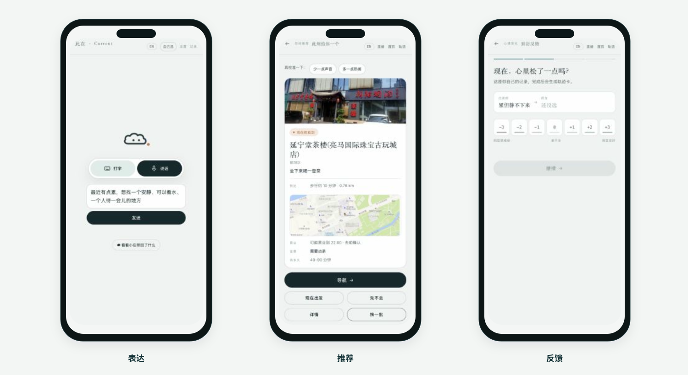
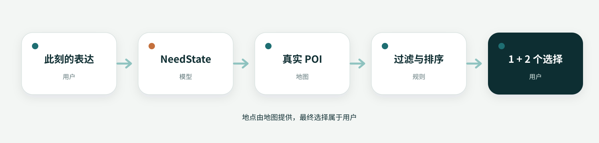
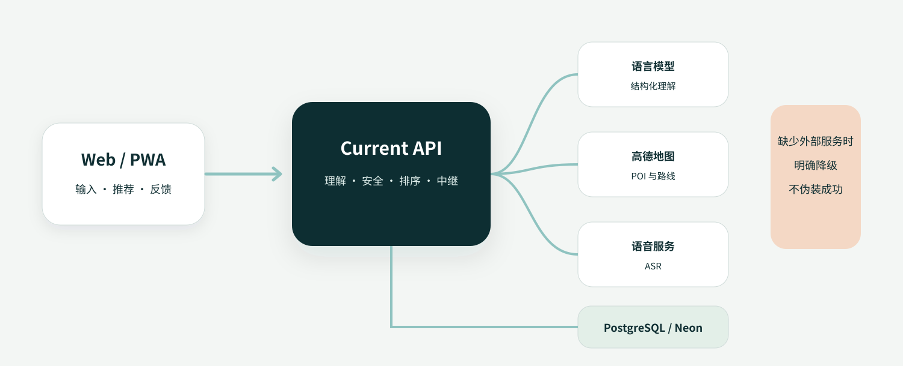
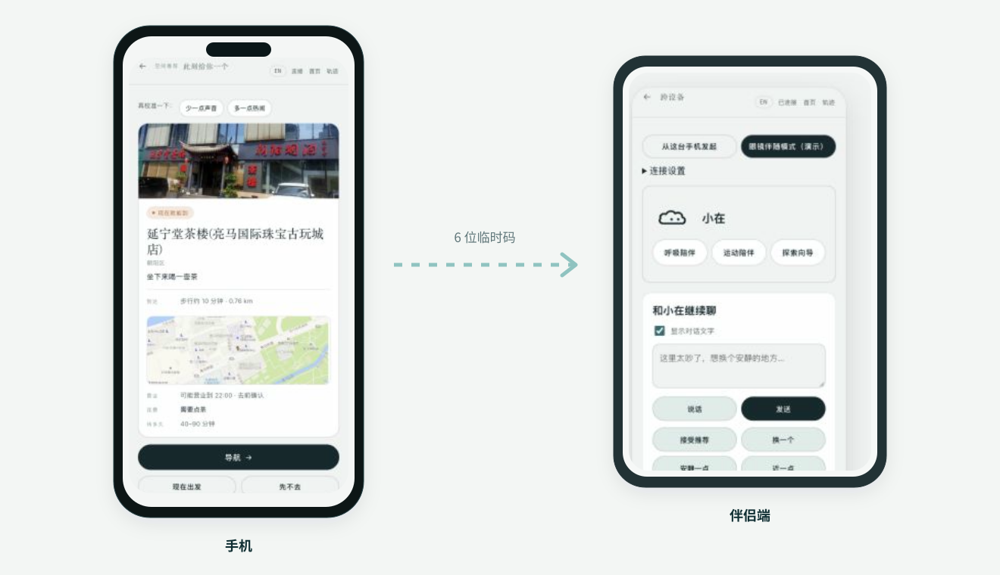

# 此在 Current

<div align="center">
  
  <p><strong>在说不清的时刻，帮你找到此刻适合去的地方。</strong></p>
  <p>
    <a href="https://ssai-current.vercel.app/"><strong>在线体验</strong></a>
    · <a href="#真实产品">真实产品</a>
    · <a href="#如何运行">如何运行</a>
    · <a href="docs/SPOTLIGHT_SUBMISSION.md">赛事说明</a>
  </p>
</div>

有时候你只是觉得闷、累，或者不想马上回家，却说不清自己究竟想去哪。

**此在 Current** 从这句话开始工作：它先理解你此刻的状态，再结合距离、营业时间、预算和环境偏好，从真实地图候选中推荐几个现在可以去的地方。你可以纠正它、换一个，也可以在到访后告诉它这次有没有帮助。

当前版本已经跑通文字／语音表达、地点推荐、地图跳转、到访反馈、私密足迹和跨设备接续。它仍然是一个原型；真实地点样本、移动端网络适配和智能眼镜接入还需要继续验证。

<!--
VIDEO SLOT · 视频完成后取消下面四行的注释，并替换封面和链接。
## 60 秒演示
[](VIDEO_URL)
-->

## 我们为什么做它

开发初期，我们以为问题只是“地点推荐不够准”，于是先整理地点、标签和匹配规则。但很快发现，真正困难的往往发生在搜索之前：人不知道该输入“公园”“书店”还是“咖啡馆”，只知道自己现在不想待在原地。

于是产品的入口从“你要找什么”变成了“你现在怎么样”。后来接入真实地图，是因为模型给出的地点再动听，只要不存在、关门了或者太远，就没有意义。再后来加入纠错和到访反馈，是因为系统第一次理解错很正常，用户应该能够说“不是这个意思”“近一点”或者“我今天就想运动”。

我们也真的踩过这种坑。一次地点核验中，系统把连锁店的错误分店当成鼓楼附近的结果；另一次测试里，返回的几个地点根本不在亮马桥周边。那之后我们不再把“模型说得像真的”当成推荐成功：模型可以理解人，但不能替地图证明一个地方存在，也不能替用户决定他该去哪。

## 真实产品

下面三张图来自当前线上版本，不是概念 UI。



一次完整使用大致是这样：

1. 用户说一句此刻真实的感受，也可以直接打字；
2. 小在复述自己的理解，用户可以随时纠正；
3. 系统从地图候选中给出 1 个主推荐和 2 个不同方向的备选；
4. 用户选择地图出发，或者继续说“近一点”“安静一点”；
5. 到访后的简短反馈只在满足证据条件时影响后续推荐。

在线体验：<https://ssai-current.vercel.app/>

> 语音能力受浏览器、网络和云服务配置影响；无法使用时可以直接切换到文字。当前线上版以手机浏览器为主要体验入口。

## 推荐是怎么产生的



我们没有让大模型直接编造地点或决定最终排名。

- **模型理解表达**：把自然语言转换为受限的 `NeedState`，包括需要、精力、社交方式、环境、预算、路程上限和明确活动。
- **地图提供地点**：POI、坐标、路线和行政城市来自高德等地图服务；人工核验地点会单独标记来源。
- **规则完成排序**：先排除距离、营业、预算等硬条件，再按需求、精力、路程、社交方式和预算计算分数。
- **用户可以推翻推断**：明确说出的活动优先级最高。“想去健身房”不会被系统擅自改成“更适合去公园”。

基础评分目前采用：

```text
45% 需求匹配 + 20% 精力适配 + 15% 路程适配
+ 10% 社交方式 + 10% 预算适配
```

权重不是永远正确的答案，而是目前可以检查、复现和继续比较的基线。我们更关注推荐错在了哪里：是理解错了、地图没找到、排序不合理，还是地点事实本身不准确。

## 地图不知道的部分

地图擅长回答“这里是什么、离你多远”，却很少知道一个空间是否适合独处、低能量停留，或者只是安静地喘口气。这也是我们开始做情绪空间数据库的原因。

数据并不是从用户的一句话直接变成公共结论。地点身份、坐标、营业信息、人工描述和到访反馈分别记录来源与核验时间；现场发现的 POI 不会自动获得一段看似真实的空间故事。

### 到访反馈不会立刻改变所有人的推荐

一次自报体验不足以证明地点对所有人都有效。只有经过地点坐标、在场时间和服务端证据检查的反馈，才可能进入空间画像；同一地点至少积累 5 次合格反馈后才参与排序，并且最多只修正标签权重的 45%。

样本不足时，界面会直接说“样本还少”，而不是制造一个看似可靠的平均分。

用户也可以补充地图没有的空间体验。公开文字先进入审核队列，照片和私人笔记默认只留在本机，提交者会得到撤回凭证。我们现在做的是一条可审核、可撤回的共创链路，不是公开情绪主页或附近的人匹配。

## 当前系统



| 部分 | 当前实现 |
| --- | --- |
| Web 客户端 | Vanilla JavaScript、Hash Router、PWA；负责输入、推荐、导航、反馈和记录 |
| API | FastAPI、Pydantic；负责严格输入、限流、日志和降级响应 |
| 情绪理解 | OpenAI-compatible LLM；不可用时回退到本地规则 |
| 地理能力 | 高德 Web Service；负责 POI、地理编码、路线和地图链接 |
| 推荐 | Python 确定性排序；负责硬过滤、加权、多样性和路程校正 |
| 数据 | PostgreSQL / Neon；保存结构化决策、到访结果、空间画像和跨设备事件 |
| 语音 | 浏览器 Speech API / 腾讯实时 ASR；失败时回到文字输入 |

代码中的降级不是为了假装一切正常。没有地图 Key 时会明确使用人工候选；数据库不可用时不冒充已经同步；语音失败时会告诉用户怎么继续。

## 手机是主入口，眼镜是可选伴侣



最初讨论智能眼镜时，我们很容易把它想成一个什么都能做的新入口。真正画完流程后，分工反而变得简单：私密表达、权限和最终确认留在手机；出发后的方向、进度和一句简短陪伴，才适合出现在眼镜或其他轻量设备上。

当前代码已经可以让手机创建六位临时码，伴侣端加入后接收理解、推荐、出发和反馈等结构化事件，也可以发回“换一个”“近一点”“安静一点”等受限操作。会话 12 小时失效，伴侣端不能直接替用户修改推荐结果。

这一部分目前仍是网页协同原型。我们尚未接入真实眼镜 SDK，也没有实现 AR 导航、视觉识别或持续环境采集。下一步需要验证的不是“能不能把页面放进眼镜”，而是它是否真的减少了低头操作和打扰。

## 目前做到了什么

| 已经可以验证 | 还没有做到 |
| --- | --- |
| 中文／英文文字表达 | 真实智能眼镜 SDK 接入 |
| 浏览器／腾讯语音路径 | 眼镜端 AR 导航和视觉识别 |
| 情绪、需要和约束理解 | 大规模真实到访数据 |
| 真实 POI 搜索与指定城市搜索 | 所有城市的人工地点核验 |
| 可解释排序、纠错与路线跳转 | 所有地区和网络环境下同样稳定的语音体验 |
| 到访反馈、私密足迹与分享卡 | 基于医疗或心理学意义的效果证明 |
| 用户共创、审核与撤回基础链路 | |
| 六位码跨设备接续原型 | |

把边界写在这里很重要：伴侣网页证明了任务可以跨设备接续，但它不等于已经接入真实眼镜；一次到访后的自报变化，也不等于疗效。

## 隐私与安全

情绪和位置都很私人，所以我们从一开始就限制系统能拿到什么。

- 不保存原始语音，也不把倾诉原文写入服务端数据库；
- 不记录连续位置轨迹；手动输入的地址只用于当前请求；
- 围栏判断在浏览器本地完成，服务端只接收证据等级和停留结果；
- 不诊断、不创建人格标签，也不用负面颜色惩罚情绪变化；
- 强痛苦表达在模型推荐之前进入安全路径，不用地点建议代替人类支持；
- 用户共创内容先进入审核队列，并提供撤回凭证。

## 测试

最近一次完整验证通过 **217 项后端测试和 70 项前端策略测试，共 287 项**。

```bash
.venv/bin/pytest -q
node --test tests/*.test.js
node --check current-client.js
node scripts/extract_place_data.mjs
```

这些测试覆盖情绪理解、明确活动、地图和坐标、推荐排序、安全红线、隐私、到访证据、跨设备、语音和 PWA 状态。自动化测试仍然不能替代 iPhone、Android、微信内置浏览器以及中国大陆／香港／海外网络的真机验收。

## 如何运行

### 1. 安装

```bash
git clone https://github.com/Juliejue/ssai-current.git
cd ssai-current

python3 -m venv .venv
.venv/bin/pip install -r requirements.txt pytest
cp .env.example .env
```

### 2. 启动

```bash
.venv/bin/uvicorn backend_app.main:app --port 8001
python3 -m http.server 8000
```

打开 <http://127.0.0.1:8000/此在-current-原型.html>。

### 3. 可选服务

| 环境变量 | 作用 | 缺失时 |
| --- | --- | --- |
| `LLM_API_KEY` / `LLM_BASE_URL` / `LLM_MODEL` | 自然语言结构化 | 回退到本地规则 |
| `AMAP_WEB_SERVICE_KEY` | POI、地理编码与路线 | 使用人工候选，并标明估算 |
| `TENCENT_SECRET_ID` / `TENCENT_SECRET_KEY` / `ASR_APP_ID` | 腾讯实时语音 | 使用浏览器语音或文字 |
| `DATABASE_URL` | 持久化数据与跨实例中继 | 保留单机体验 |
| `ALLOWED_ORIGINS` | 浏览器跨域白名单 | 只允许默认本地地址 |

密钥只放在服务端环境变量中，不要提交到仓库。完整配置见 `开通清单-外部服务.md`。

## 仓库结构

```text
此在-current-原型.html       Web 原型与页面路由
current-client.js            AI、语音、地图和旅程状态
current-moments.js / css     足迹、共创和视觉状态
xiaozai-voice.js             伴侣端朗读控制
reach-policy.js              主动触达和不打扰策略

backend_app/
  interpretation.py          结构化理解、规则回退和安全入口
  discovery.py               附近／指定城市地点发现
  recommender.py             确定性排序和路线校正
  map_provider.py            地理编码、路线和坐标转换
  presence.py                在场证据验证
  space_profiles.py          空间画像
  community.py               用户共创、审核和撤回
  relay.py                   跨设备事件中继

tests/                       前后端、安全、隐私和地图回归
scripts/                     数据迁移、地点核验和审核工具
brand/                       品牌和小在角色资产
CurrentHRVDemo/              Swift / HealthKit 探索实验
```

## 接下来

提交之后，我们最想继续验证几个具体问题：

1. 同一句状态在不同城市里，能否得到同样可信的候选；
2. 用户没有点开推荐时，究竟是理解、地点、距离还是表达出了问题；
3. 智能眼镜是否真的减少低头操作，而不是增加一个需要维护的屏幕；
4. 少量真实到访数据能否改善推荐，同时不损害隐私或把个例包装成规律。

赛事的完整回答、深圳阶段计划和资源需求放在 [Spotlight 提交说明](docs/SPOTLIGHT_SUBMISSION.md) 中。主 README 只保留产品、代码和当前能被验证的事实。

## 团队

- **Estelle Ma** — 组长
- **Jue Chen、Camille Yu、PuffyFish Yang** — 核心成员

团队工作覆盖产品、用户研究、AI Agent、推荐与地理工程、视觉设计、智能硬件探索、测试和部署。

欢迎通过 GitHub Issues 提交可复现问题、地点纠错、移动端兼容报告，以及 GIS、推荐系统、设备适配和隐私方面的建议。请不要在 Issue 中提交真实倾诉原文、精确住址、连续位置、原始语音或 API 密钥。

## 许可证

本仓库当前用于赛事评审、产品验证和团队协作，尚未授予开源许可证。除第三方素材另有说明外，代码、设计和品牌资产保留全部权利。

---

<div align="center">
  <sub>此在 Current · 更真实地生活</sub>
</div>
